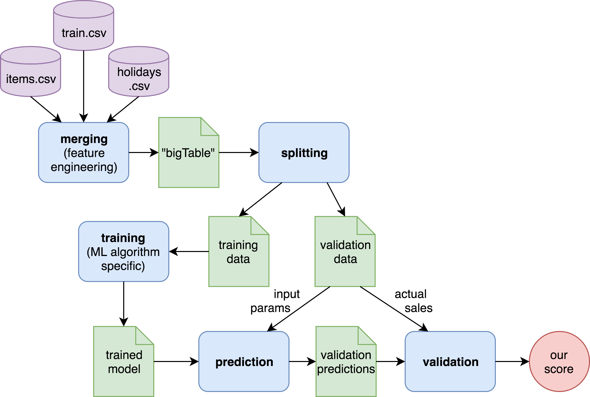

# TWDE Datalab 

This is the onboarding document for the TWDE Datalab. If you want to get involved, find something confusing, or just want to say hi, [please open an issue](https://github.com/ThoughtWorksInc/twde-datalab/issues) or join the [Slack channel](https://tw-datalab.slack.com). Please also check out [the slide deck we use for our hands-on workshops](https://docs.google.com/presentation/d/1rbonEYaNZ0gIDc1ieW-PmSxl-aqyupI9UI2WGgPalus/edit?usp=sharing).

1. [Introduction](https://github.com/ThoughtWorksInc/twde-datalab/blob/master/README.md#introduction)
1. [Data](https://github.com/ThoughtWorksInc/twde-datalab/blob/master/README.md#data)
1. [Workflow](https://github.com/ThoughtWorksInc/twde-datalab/blob/master/README.md#workflow)
1. [Getting Started Locally](https://github.com/ThoughtWorksInc/twde-datalab/blob/master/README.md#getting-started-locally)
1. [Ways To Get Involved](https://github.com/ThoughtWorksInc/twde-datalab/blob/master/README.md#ways-to-get-involved)
1. [Next Steps: Getting started on AWS](https://github.com/ThoughtWorksInc/twde-datalab/blob/master/README.md#next-steps-getting-started-on-aws)

## Introduction
It's our goal to onboard you to the basics of data science as quickly and thoroughly as possible. We've selected a challenge from kaggle.com that, broadly speaking, compares to a realistic problem we would tackle for clients. The specific problem is demand forecasting for an Ecuadorian grocery company. For details, see [the Favorita Grocery Sales Forecasting Kaggle competition](https://www.kaggle.com/c/favorita-grocery-sales-forecasting).

## Data
The competition provides [4 years of purchasing history](https://www.kaggle.com/c/favorita-grocery-sales-forecasting/data) along with data about things like the price of oil (Ecuador is a net exporter of oil), and public holidays in Ecuador. Our goal is to analyze this data, plus any other data we acquire (see the [external data discussion on kaggle](https://www.kaggle.com/c/favorita-grocery-sales-forecasting/discussion/41537)), and produce an estimated `unit sales` for each item in each store for a given time period. 

To make it easier to get started, we provide a data set that is a subset of the original data. The sample consists of only one type of store in one city (Quito), and only includes transaction data from the last year. This dramatically reduces the size of the data, which limits our predictive capabilities, but will be more than enough to get started with thorough analysis.

## Workflow
We have structured our workflow into five steps: merging, splitting, training, predicting, and validating.

Each step has a correspondingly named .py file except training and predicting which are put together in an algorithm-specific file such as decision_tree.py. 

We provide two functioning machine learning models: a simple decision tree and a time series forecasting model. Check out the [description for our decision tree pipeline](https://github.com/ThoughtWorksInc/twde-datalab/blob/master/decision_tree_overview.md) for details about our implementation.  

## Getting Started Locally
This project expects Python 3 to be used. The easiest way to get Python 3 is by using [Anaconda](https://www.anaconda.com/download).

1. `git clone https://github.com/ThoughtWorksInc/twde-datalab && cd twde-datalab`
1. `pip install -r requirements.txt`
1. `sh run_decisiontree_pipeline.sh`

After running the pipeline, which can take a while the first time as it downloads the reduced raw data from our public S3 bucket (s3://twde-datalab/raw), the output data will be stored in folders in the corresponding to the file that created them, e.g.
- `data/merger/bigTable.csv`
- `data/splitter/train.csv`
- `data/splitter/validation.csv`
- `data/decision_tree/model.pkl`
- `data/decision_tree/score_and_metadata.csv`

If running the decision tree pipeline worked without error, you should see a score (error rate) of ~0.83 being printed.
The lower the score the better the prediction, so you are ready to start science-ing on your own! Next, you can consider:
- [Reading about how (and why) we implement the pipeline for the decision tree the way we do](https://github.com/ThoughtWorksInc/twde-datalab/blob/master/decision_tree_overview.md)
- Run the tests: just run `pytest` in the projects root directory
- [Doing some exploratory analysis and document what you find](https://github.com/ThoughtWorksInc/twde-datalab/blob/master/jupyter_notebooks)
- [Coming up with a hypothesis about some feature engineering tasks and test your hypothesis](https://github.com/ThoughtWorksInc/twde-datalab/blob/master/jupyter_notebooks/Feature_Engineering.ipynb)
- See also "Ways To Get Involed" below, or search our issues for more things!

## Ways To Get Involved
There are many low hanging fruit ready to be picked by you, dear reader, if you want to get involved in the Data Science world at ThoughtWorks. You should look to the [issues](https://github.com/ThoughtWorksInc/twde-datalab/issues) on this repository for specifics or to ask for guidance. Categorically, some of the possible next steps include:
  - Use more features for existing algorithms
    - Daily weather
    - Price of oil
    - Natural disasters
    - Political unrest
  - Hyperparameterize the Existing Machine Learning Algorithms
  - Try Different Models
    - Random forest
    - Neural network
    - Time series regression for each item
  - Improve Validation Strategy 
    - Use 30% of the data to validate
    - Don't only validate on the last time period of the training data
  - Improving the pipeline setup
    - Can data preprocessing be used for multiple algorithms?
    - Streamlining deployment on AWS
  
The maintainers of the repository (Emma, Jin, Arif) will be happy to help you get started. 
You are also welcome to join the discussion in our Slack channel at https://tw-datalab.slack.com (simply use your TW mail address to sign up).

Let's get started!

###### (Pictured above: the android named Data, from Star Trek - The Next Generation)

## Next Steps: Getting started on AWS

The default master branch represents a simplified version of our work that is optimised for comprehensibility and for local development, which is also why a dramatically downsized dataset is used.
For really validating whether an improvement or alternative approach you applied significantly increases prediction quality you probably want to run the training on the entire dataset and you probably don't want to run it locally. 

That is what the branch https://github.com/ThoughtWorksInc/twde-datalab/tree/run-on-aws is all about (a.k.a. the 'pro' branch).

**IMPORTANT:** The software in the Git repository does not contains AWS credentials or any other way to access an AWS account. 
So, please make sure you have access to an AWS account. 
If you want to use the AWS account of the TWDE Datalab reach out the maintainers.

We have been exploring different ways to deploy the code on AWS. 
Our first approach was through creating Elastic Map Reduce clusters, but since we settled on pandas instead of Spark at some point, we haven't been doing distributed computing very much.
Therefore, there are two main ways we are using AWS resources: AWS Data Pipeline and Jupyter on EC2. 
We have been using the former to run our decision tree model on larger data sets and the latter (Jupyter on EC2) to run the Prophet time series model.

### Getting started using Data Pipeline

If you haven't done so, install the AWS command line tools. If you are doing this now, please don't forget to configure your credentials, too.

1. `pip install awscli`
1. ` aws configure` (this will ask you for your credentials and store them in `~/.aws`)

Now run a deployment script from the `deployment` directory

1. `cd deployment`
1. `./deploy-pipeline.sh -j all -n {name for the pipeline goes here}`

This script will do the following:
- create a shell script based on `run_pipeline.sh`
- upload the shell script to S3
- create an AWS data pipeline following `pipeline-definition.json`
- start the pipeline

The output (and logs) are available via the AWS console.
Unfortunately, we've run into some issues with large file sizes, which are documented here https://github.com/ThoughtWorksInc/twde-datalab/issues/25.

### Getting started using Jupyter on EC2

Another, maybe even simpler way to exploit cloud computing, is by [installing Anaconda on AWS EC2 instance](https://hackernoon.com/aws-ec2-part-3-installing-anaconda-on-ec2-linux-ubuntu-dbef0835818a) and [setting up Jupyter Notebooks on AWS](https://towardsdatascience.com/setting-up-and-using-jupyter-notebooks-on-aws-61a9648db6c5). 

For running our Prophet time series model, we published a ready to go AMI image `tw_datalab_prophet_forecast_favorita` that already includes the relevant Jupyter notebooks. 
Just search for this image in 'Community AMIs' when launching an EC2 machine and make sure you open port 8888.
Then ssh into your machine and start the Jupyter server:  

1. `jupyter notebook --no-browser --port=8888`

Afterwards you should be able to open Jupyter in your browser at https://ec2-{public-ip-of-ec2-machine}.{my-region}.compute.amazonaws.com:8888. When asked for a password, simply type 'datalab'.
